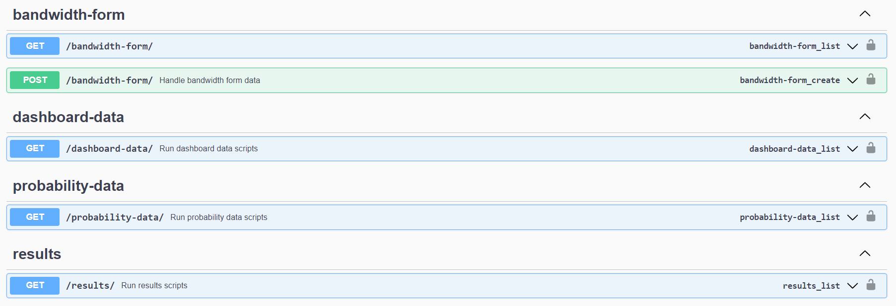

# <a href="https://codechallenge-1.onrender.com/">MegaSena Generator</a>

<div align="center">
 <a href="#technologies">Technologies</a> •
 <a href="#running_backend">Running the Backend</a> •
  <a href="#running_frontend">Running the Frontend</a>
</div>
<br>
This is a personal project that utilizes statistical analysis and machine learning algorithms to generate lottery numbers for the Mega-Sena, the biggest lottery game in Brazil.

## :camera: Overview

<div align="center" >
  
</div>

<br>
<br>
The Mega-Sena game generator employs historical frequency data and standard deviation to calculate the probability of specific number combinations appearing in future lottery draws. In addition, advanced machine learning algorithms, such as Long Short-Term Memory (LSTM) and ARIMA models, are utilized to analyze past patterns and provide accurate predictions for future lottery outcomes.

<br>
<br>
This repository contains the code for the Mega-Sena game generator, along with detailed documentation on how to use the program to generate lottery numbers. While statistical analysis and machine learning can provide valuable insights and predictions, it's important to note that there is no guarantee of winning the lottery. Even with predictions based on tendencies observed in moving average graphs and highly accurate results from the RNN, the standard deviation is still too high to accurately predict a specific number. Ultimately, the probabilities of guessing the correct numbers are the same as those when choosing numbers randomly.
<br>
<br>
Thank you for checking out the Mega-Sena game generator repository and I hope it proves to be a fun and informative tool for generating lottery numbers, learning a bit of statistics, data science and machine learning!
<br>
<br>
Check the live website: <br>
https://megasena-generator.vercel.app/

<br>
<br>
Check the live API backend on PythonAnywhere:<br>
https://leonardoacr.pythonanywhere.com/api/results/

<br>
<br>
Check the live API backend on EC2 (temporarily available):<br>
http://54.205.57.183/api/results/

<br>
<br>
Swagger is not allowing access in production mode, so you can check all routes cloning the app and running it in a localhost:<br>
http://localhost:8000/swagger

<br>
<br>
Here is the Swagger route screenshot:<br>
 

<br>
<br>
The code is divided into 4 main projects:

- Jupyter Notebook: This was the initial approach to the problem, offering a detailed description of each feature on the app, and providing deep statistical analysis. In addition, the Jupyter Notebook also used advanced machine learning algorithms, such as LSTM and ARIMA, to predict future lottery outcomes. However, these models were not implemented on the website as they required too much processing power to run.

  - LSTM models are a type of recurrent neural network that can capture long-term dependencies in sequential data, making them well-suited for time-series prediction tasks like lottery number generation. ARIMA models, on the other hand, are a statistical method for analyzing and forecasting time-series data.

- Datascience: The statistical data based on historical frequency, created in the Jupyter Notebook, was implemented on Python scripts. These scripts provide data to the backend.

- Backend: The backend was made with Python using the Django Framework, which serves an API that provides the frontend with data from the datascience scripts. Swagger was used to describe all the routes.

- Frontend: The frontend was made with React, using NextJS and TailwindCSS, fully responsive with desktops and mobile. It's responsible for presenting the website's interface and showing data through interactive dashboards and outputs.

<div id="technologies">
  <h2>:rocket: Technologies</h2>
</div>

### Jupyter Notebook

✔️ Pandas | ✔️ NumPy | ✔️ Seaborn | ✔️ matplotlib | ✔️ ARIMA | ✔️ LSTM

### Backend

✔️ Python | ✔️ Django | ✔️ Swagger (drg-yasg)

### Frontend

✔️ TypeScript | ✔️ ReactJS | ✔️ NextJS | ✔️ TailwindCSS | ✔️ ChartJS

<div id="running_backend">
  <h2>⚙ Running [Backend]</h2>
</div>

```bash
# Clone this repository
$ git clone https://github.com/leonardoacr/megasena-generator

# Access the backend folder

$ cd backend

# Update pip

$ update pip
$ python.exe -m pip install --upgrade pip

# Activate the virtual environment

$ pip install virtualenv
$ virtualenv venv
$ venv\scripts\activate

# Install dependencies

$ pip install -r requirements.txt

# Go to "myproject" directory

$ cd myproject

# Run the server on http://127.0.0.1:8000

$ python manage.py runserver
```

<div id="running_frontend">
  <h2>⚙ Running [Frontend]</h2>
</div>

```bash
# Access the frontend folder

$ cd frontend

# Install packages

$ npm install

# Run the server on http://localhost:3000

$ npm run dev
```

Interesting papers I read to make this generator:
